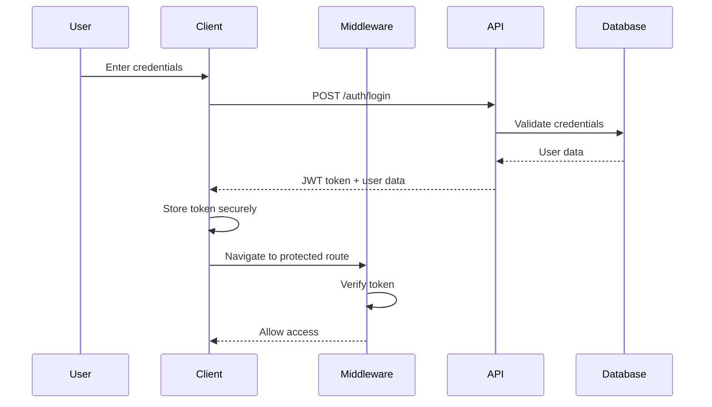

# Authentication

## Authentication System Overview

The application implements a comprehensive JWT-based authentication system with role-based access control, secure token management, and multi-layer protection.

## Authentication Flow

### 1. Login Process


### 2. Token Verification
```typescript
// middleware.ts - JWT Verification
async function verifyToken(token: string): Promise<boolean> {
  try {
    const publicKey = await getPublicKey();
    if (!publicKey) {
      return false;
    }

    await jwtVerify(token, publicKey, {
      algorithms: ["ES256"],
    });
    return true;
  } catch (error) {
    console.error("Token verification failed:", error);
    return false;
  }
}
```

## Authentication Components

### Auth Context
```typescript
// contexts/AuthContext.tsx
interface AuthContextType {
  user: AuthUser | null;
  loading: boolean;
  error: string | null;
  isAuthenticated: boolean;
  login: (credentials: LoginCredentials) => Promise<void>;
  logout: () => Promise<void>;
  clearError: () => void;
  refreshAuth: () => void;
}

export function AuthProvider({ children }: AuthProviderProps) {
  const dispatch = useAppDispatch();
  const user = useAppSelector(selectUser);
  const isAuthenticated = useAppSelector(selectIsAuthenticated);
  
  const [loginMutation] = useLoginMutation();
  const [logoutMutation] = useLogoutMutation();

  // Initialize auth state from storage
  useEffect(() => {
    const initAuth = () => {
      const { user: storedUser, token, isExpired } = initializeAuthFromStorage();

      if (storedUser && token && !isExpired) {
        dispatch(setAuthState({
          user: storedUser,
          token,
        }));
      } else if (isExpired) {
        clearAuthData();
        dispatch(clearAuthState());
      }
    };

    initAuth();
  }, [dispatch]);

  const login = useCallback(async (credentials: LoginCredentials) => {
    try {
      const result = await loginMutation(credentials).unwrap();

      if (result.success && result.user) {
        // Store tokens securely
        setTokens(result.user.token);
        setUserData(result.user);

        // Update Redux state
        dispatch(setAuthState({
          user: result.user,
          token: result.user.token
        }));
      }
    } catch (error) {
      throw error;
    }
  }, [loginMutation, dispatch]);

  const logout = useCallback(async () => {
    try {
      await logoutMutation().unwrap();
    } catch (error) {
      console.error("Logout API failed:", error);
    } finally {
      clearAuthData();
      dispatch(clearAuthState());
    }
  }, [logoutMutation, dispatch]);

  return (
    <AuthContext.Provider value={{
      user,
      loading,
      error,
      isAuthenticated,
      login,
      logout,
      clearError,
      refreshAuth,
    }}>
      {children}
    </AuthContext.Provider>
  );
}
```

### Auth Guard Component
```typescript
// components/auth/AuthGuard.tsx
interface AuthGuardProps {
  children: React.ReactNode;
  requiredRole?: UserRole;
  fallback?: React.ReactNode;
}

export function AuthGuard({
  children,
  requiredRole,
  fallback = <LoadingSpinner />,
}: AuthGuardProps) {
  const { user, isLoading, isAuthenticated } = useAuthContext();
  const router = useRouter();

  useEffect(() => {
    if (!isLoading && !isAuthenticated) {
      router.push('/signin');
    }
  }, [isAuthenticated, isLoading, router]);

  if (isLoading) {
    return fallback;
  }

  if (!isAuthenticated) {
    return null;
  }

  // Role-based access control
  if (requiredRole && user?.userType !== requiredRole) {
    return (
      <div className="flex flex-col items-center justify-center min-h-[400px]">
        <h2 className="text-xl font-semibold mb-4">Access Denied</h2>
        <p className="text-muted-foreground mb-4">
          You don't have permission to access this page.
        </p>
        <Button onClick={() => router.back()}>Go Back</Button>
      </div>
    );
  }

  return <>{children}</>;
}
```

### Protected Route HOC
```typescript
// components/auth/ProtectedRoute.tsx
export function withAuth<P extends object>(
  Component: React.ComponentType<P>,
  requiredRole?: UserRole
): React.ComponentType<P> {
  return function AuthenticatedComponent(props: P) {
    return (
      <AuthGuard requiredRole={requiredRole}>
        <Component {...props} />
      </AuthGuard>
    );
  };
}

// Usage
const ProtectedDashboard = withAuth(Dashboard, 'teacher');
```

## Route Protection

### Middleware Protection
```typescript
// middleware.ts
const PUBLIC_ROUTES = [
  "/",
  "/signin",
  "/signup",
  "/forgot-password",
  "/reset-password",
  "/otp",
  "/unauthorized",
];

const PROTECTED_ROUTES = [
  "/classroom",
  "/inbox",
  "/profile",
  "/users",
];

export async function middleware(request: NextRequest) {
  const { pathname } = request.nextUrl;
  const token = getTokenFromRequest(request);

  // Handle protected routes
  if (isProtectedRoute(pathname)) {
    if (!token) {
      const loginUrl = new URL("/signin", request.url);
      loginUrl.searchParams.set("callbackUrl", pathname);
      return NextResponse.redirect(loginUrl);
    }

    const isValidToken = await verifyToken(token);
    if (!isValidToken) {
      const loginUrl = new URL("/signin", request.url);
      loginUrl.searchParams.set("callbackUrl", pathname);
      loginUrl.searchParams.set("error", "session-expired");
      return NextResponse.redirect(loginUrl);
    }
  }

  // Redirect authenticated users from auth pages
  if (token && isAuthRoute(pathname)) {
    const isValidToken = await verifyToken(token);
    if (isValidToken) {
      return NextResponse.redirect(new URL("/classroom/dashboard", request.url));
    }
  }

  return NextResponse.next();
}
```

### API Route Protection
```typescript
// API middleware for protected endpoints
const PROTECTED_API_ROUTES = [
  "/api/classroom",
  "/api/users",
  "/api/profile",
];

export async function middleware(request: NextRequest) {
  const { pathname } = request.nextUrl;

  if (pathname.startsWith("/api/") && isProtectedApiRoute(pathname)) {
    const token = getTokenFromRequest(request);
    
    if (!token) {
      return NextResponse.json(
        { error: "Authentication required" },
        { status: 401 }
      );
    }

    const isValidToken = await verifyToken(token);
    if (!isValidToken) {
      return NextResponse.json(
        { error: "Invalid or expired token" },
        { status: 401 }
      );
    }
  }

  return NextResponse.next();
}
```

## Token Management

### Secure Token Storage
```typescript
// utils/tokenManager.ts
const TOKEN_KEY = 'auth-token';
const USER_KEY = 'user-data';
const REFRESH_TOKEN_KEY = 'refresh-token';
const LAST_ACTIVITY_KEY = 'last-activity';

export function setTokens(token: string, refreshToken?: string) {
  try {
    // Store in httpOnly cookie (preferred for security)
    document.cookie = `${TOKEN_KEY}=${token}; path=/; secure; samesite=strict`;
    
    if (refreshToken) {
      document.cookie = `${REFRESH_TOKEN_KEY}=${refreshToken}; path=/; secure; samesite=strict`;
    }

    // Fallback to localStorage for development
    if (process.env.NODE_ENV === 'development') {
      localStorage.setItem(TOKEN_KEY, token);
      if (refreshToken) {
        localStorage.setItem(REFRESH_TOKEN_KEY, refreshToken);
      }
    }
  } catch (error) {
    console.error('Failed to store tokens:', error);
  }
}

export function getToken(): string | null {
  try {
    // Try to get from cookie first
    const cookieToken = getCookieValue(TOKEN_KEY);
    if (cookieToken) {
      return cookieToken;
    }

    // Fallback to localStorage
    return localStorage.getItem(TOKEN_KEY);
  } catch (error) {
    console.error('Failed to retrieve token:', error);
    return null;
  }
}

export function setUserData(user: AuthUser) {
  try {
    localStorage.setItem(USER_KEY, JSON.stringify(user));
    updateLastActivity();
  } catch (error) {
    console.error('Failed to store user data:', error);
  }
}

export function getUserData(): AuthUser | null {
  try {
    const userData = localStorage.getItem(USER_KEY);
    return userData ? JSON.parse(userData) : null;
  } catch (error) {
    console.error('Failed to retrieve user data:', error);
    return null;
  }
}

export function clearAuthData() {
  try {
    // Clear cookies
    document.cookie = `${TOKEN_KEY}=; path=/; expires=Thu, 01 Jan 1970 00:00:01 GMT`;
    document.cookie = `${REFRESH_TOKEN_KEY}=; path=/; expires=Thu, 01 Jan 1970 00:00:01 GMT`;

    // Clear localStorage
    localStorage.removeItem(TOKEN_KEY);
    localStorage.removeItem(REFRESH_TOKEN_KEY);
    localStorage.removeItem(USER_KEY);
    localStorage.removeItem(LAST_ACTIVITY_KEY);
  } catch (error) {
    console.error('Failed to clear auth data:', error);
  }
}

export function updateLastActivity() {
  try {
    localStorage.setItem(LAST_ACTIVITY_KEY, Date.now().toString());
  } catch (error) {
    console.error('Failed to update last activity:', error);
  }
}

export function initializeAuthFromStorage() {
  const token = getToken();
  const user = getUserData();
  const lastActivity = localStorage.getItem(LAST_ACTIVITY_KEY);
  
  // Check if token is expired (24 hours)
  const isExpired = lastActivity 
    ? Date.now() - parseInt(lastActivity) > 24 * 60 * 60 * 1000
    : true;

  return {
    token,
    user,
    isExpired,
  };
}
```

### Token Refresh
```typescript
// Auto token refresh
export function useTokenRefresh() {
  const dispatch = useAppDispatch();
  const { isAuthenticated } = useAuthContext();
  const [refreshToken] = useRefreshTokenMutation();

  useEffect(() => {
    if (!isAuthenticated) return;

    const refreshInterval = setInterval(async () => {
      try {
        const result = await refreshToken().unwrap();
        
        // Update stored token
        setTokens(result.token);
        
        // Update Redux state
        dispatch(updateToken(result.token));
      } catch (error) {
        console.error('Token refresh failed:', error);
        // Force logout on refresh failure
        dispatch(clearAuthState());
      }
    }, 15 * 60 * 1000); // Refresh every 15 minutes

    return () => clearInterval(refreshInterval);
  }, [isAuthenticated, refreshToken, dispatch]);
}
```

## Authentication Forms

### Sign In Form
```typescript
// components/auth/SigninForm.tsx
const signinSchema = z.object({
  identifier: z.string().min(1, "Email or username is required"),
  password: z.string().min(6, "Password must be at least 6 characters"),
});

export function SigninForm() {
  const { login } = useAuthContext();
  const router = useRouter();
  const searchParams = useSearchParams();
  const [isLoading, setIsLoading] = useState(false);

  const form = useForm<z.infer<typeof signinSchema>>({
    resolver: zodResolver(signinSchema),
    defaultValues: {
      identifier: "",
      password: "",
    },
  });

  const onSubmit = async (values: z.infer<typeof signinSchema>) => {
    setIsLoading(true);
    try {
      await login(values);
      
      const callbackUrl = searchParams.get('callbackUrl') || '/classroom/dashboard';
      router.push(callbackUrl);
      
      toast.success("Signed in successfully");
    } catch (error) {
      const errorMessage = error instanceof Error 
        ? error.message 
        : "Sign in failed";
      toast.error(errorMessage);
    } finally {
      setIsLoading(false);
    }
  };

  return (
    <Card className="w-full max-w-md">
      <CardHeader>
        <CardTitle>Sign In</CardTitle>
        <CardDescription>
          Enter your credentials to access your account
        </CardDescription>
      </CardHeader>
      <CardContent>
        <Form {...form}>
          <form onSubmit={form.handleSubmit(onSubmit)} className="space-y-4">
            <FormField
              control={form.control}
              name="identifier"
              render={({ field }) => (
                <FormItem>
                  <FormLabel>Email or Username</FormLabel>
                  <FormControl>
                    <Input
                      placeholder="Enter your email or username"
                      {...field}
                    />
                  </FormControl>
                  <FormMessage />
                </FormItem>
              )}
            />
            
            <FormField
              control={form.control}
              name="password"
              render={({ field }) => (
                <FormItem>
                  <FormLabel>Password</FormLabel>
                  <FormControl>
                    <Input
                      type="password"
                      placeholder="Enter your password"
                      {...field}
                    />
                  </FormControl>
                  <FormMessage />
                </FormItem>
              )}
            />

            <Button type="submit" className="w-full" disabled={isLoading}>
              {isLoading ? (
                <>
                  <Loader2 className="mr-2 h-4 w-4 animate-spin" />
                  Signing in...
                </>
              ) : (
                "Sign In"
              )}
            </Button>
          </form>
        </Form>
      </CardContent>
      <CardFooter className="flex flex-col space-y-2">
        <Link
          href="/forgot-password"
          className="text-sm text-muted-foreground hover:text-primary"
        >
          Forgot your password?
        </Link>
        <div className="text-sm text-muted-foreground">
          Don't have an account?{" "}
          <Link href="/signup" className="text-primary hover:underline">
            Sign up
          </Link>
        </div>
      </CardFooter>
    </Card>
  );
}
```

### Sign Up Form
```typescript
// components/auth/SignupForm.tsx
export function SignupForm() {
  const [step, setStep] = useState<'role' | 'form'>('role');
  const [selectedRole, setSelectedRole] = useState<UserRole | null>(null);

  const handleRoleSelect = (role: UserRole) => {
    setSelectedRole(role);
    setStep('form');
  };

  if (step === 'role') {
    return <RoleSelector onRoleSelect={handleRoleSelect} />;
  }

  return (
    <div className="space-y-4">
      <Button
        variant="ghost"
        onClick={() => setStep('role')}
        className="mb-4"
      >
        <ArrowLeft className="mr-2 h-4 w-4" />
        Back to role selection
      </Button>
      
      {selectedRole === 'school' ? (
        <SchoolSignupForm />
      ) : (
        <PersonSignupForm userType={selectedRole!} />
      )}
    </div>
  );
}
```

## Role-Based Access Control

### Permission System
```typescript
// lib/permissions.ts
export enum Permission {
  READ_STUDENTS = 'read:students',
  WRITE_STUDENTS = 'write:students',
  READ_TEACHERS = 'read:teachers',
  WRITE_TEACHERS = 'write:teachers',
  READ_CLASSROOMS = 'read:classrooms',
  WRITE_CLASSROOMS = 'write:classrooms',
  MANAGE_SCHOOL = 'manage:school',
}

export const ROLE_PERMISSIONS: Record<UserRole, Permission[]> = {
  student: [
    Permission.READ_STUDENTS,
    Permission.READ_CLASSROOMS,
  ],
  teacher: [
    Permission.READ_STUDENTS,
    Permission.WRITE_STUDENTS,
    Permission.READ_TEACHERS,
    Permission.READ_CLASSROOMS,
    Permission.WRITE_CLASSROOMS,
  ],
  school: [
    Permission.READ_STUDENTS,
    Permission.WRITE_STUDENTS,
    Permission.READ_TEACHERS,
    Permission.WRITE_TEACHERS,
    Permission.READ_CLASSROOMS,
    Permission.WRITE_CLASSROOMS,
    Permission.MANAGE_SCHOOL,
  ],
};

export function hasPermission(userRole: UserRole, permission: Permission): boolean {
  return ROLE_PERMISSIONS[userRole]?.includes(permission) || false;
}

export function usePermissions() {
  const { user } = useAuthContext();
  
  const checkPermission = useCallback((permission: Permission) => {
    if (!user) return false;
    return hasPermission(user.userType, permission);
  }, [user]);

  return { checkPermission };
}
```

### Permission-based Components
```typescript
// components/auth/PermissionGuard.tsx
interface PermissionGuardProps {
  permission: Permission;
  children: React.ReactNode;
  fallback?: React.ReactNode;
}

export function PermissionGuard({
  permission,
  children,
  fallback = null,
}: PermissionGuardProps) {
  const { checkPermission } = usePermissions();

  if (!checkPermission(permission)) {
    return <>{fallback}</>;
  }

  return <>{children}</>;
}

// Usage
<PermissionGuard permission={Permission.WRITE_STUDENTS}>
  <Button onClick={handleCreateStudent}>
    Create Student
  </Button>
</PermissionGuard>
```

## Security Best Practices

### 1. Token Security
- Use httpOnly cookies for token storage in production
- Implement secure, sameSite cookie attributes
- Set appropriate token expiration times
- Implement token refresh mechanism

### 2. Route Protection
- Implement both server-side and client-side protection
- Use middleware for server-side route guards
- Implement role-based access control
- Handle authentication state properly

### 3. Error Handling
- Don't expose sensitive information in error messages
- Implement proper error boundaries
- Log security events for monitoring
- Handle network errors gracefully

### 4. Session Management
- Track user activity for session timeout
- Implement proper logout functionality
- Clear all authentication data on logout
- Handle concurrent sessions appropriately